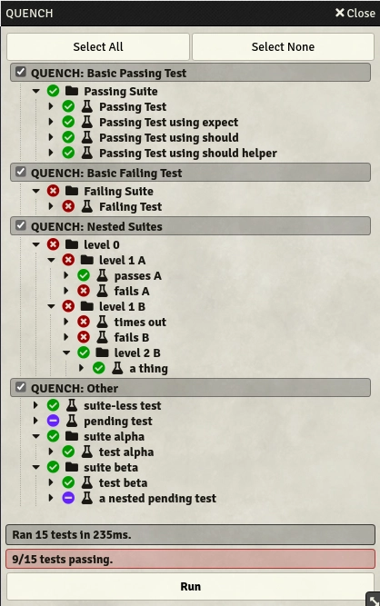

<h1 align=center>
    
  <br>
  Quench
</h1>

<p align=center>
  
  <a href="https://github.com/Ethaks/FVTT-Quench/releases/latest">
    
  </a>
  <a href="https://forge-vtt.com/bazaar#package=quench">
    
  </a>
  <br />
  <a href="https://www.foundryvtt-hub.com/package/quench/">
    
  </a>
  
</p>

Harden your Foundry module or system code with end-to-end UI tests directly within Foundry.
Powered by [Mocha](https://mochajs.org/) and also includes [Chai](https://www.chaijs.com/).

Quench adds a test runner UI as a native Foundry `Application`.
You can register test suites with quench and view them in the test runner, then run them and view the results.



## Usage

The primary public API is the `Quench` class.
A global instance of `Quench` is available as a global called `quench`, guaranteed to be initialized after the core `"init"` hook.
This class includes references to both the mocha and chai globals, as well as some methods to add new test batches and run the tests.

Quench uses "test batches" as another layer of organization above the built-in mocha suites and tests.
Test batches are at the top layer of the hierarchy, can contain suites and/or tests, and can be enabled or disabled through the Quench UI.
Enabling or disabling batches allows you to pick and choose only a subset of suites and tests to execute in one test run.

### `quenchReady` Hook

**Usage of the `"quenchReady"` hook has been deprecated with Quench 0.5, but the hook is still fired for backwards compatibility.**

Quench provides a `"quenchReady"` hook, which indicates when Quench is ready for you to start registering batches.
`"quenchReady"` is guaranteed to occur after the core `"init"` hook, as it is fired in Quench's `"setup"` hook.
`"quenchReady"` receives the current `Quench` instance as an argument.

### Register a test batch

You can register a Quench test batch to be executed with Quench by calling `quench.registerBatch`.
`registerBatch` takes the following arguments:

- `key` – a unique batch key that identifies this test batch.
  If multiple test batches are registered with the same key, the latest registration will overwrite previous registrations.
- `registrationFunction` – this function will be executed to register the suites and tests within this batch.
  It takes a `context` argument, which contains the following Mocha and Chai functions necessary for defining a suite of tests:
  - Mocha – `describe`, `it`, `after`, `afterEach`, `before`, `beforeEach`, and `utils`.
  - Chai – `assert`, `expect`, and `should`. `should` is also made available by it extending `Object.prototype`.
- `options` -
  - `displayName` – the name for this batch that will be shown in the UI and in the detailed test results.
    This is optional, Quench will fall back to the batch key if omitted.
  - `snapBaseDir` – the directory from which snapshots for this batch will be read, and where snapshots will be stored.
    This is optional, Quench will fall back to `Data/__snapshots__/<package name>/`, with each batch having its own directory there.

Example:

```js
Hooks.on("quenchReady", (quench) => {
  quench.registerBatch(
    "quench.examples.basic-pass",
    (context) => {
      const { describe, it, assert } = context;

      describe("Passing Suite", function () {
        it("Passing Test", function () {
          assert.ok(true);
        });
      });
    },
    { displayName: "QUENCH: Basic Passing Test" },
  );
});
```

### Snapshots

**Snapshot handling is currently in alpha! The current API is not final and subject to change – all input is welcome!**

Quench supports snapshot testing, allowing for Chai's comparisons to work with data previously serialised using [pretty-format](https://www.npmjs.com/package/pretty-format) – this includes support for regular JS objects, as well as e.g. DOM elements.
To compare an object to a snapshot, you can use `matchSnapshot()` as assertion.

If a test run includes failed tests using snapshots, Quench will show a button in its UI that allows to update the snapshots of those tests.
Alternatively, setting `quench.snapshots.enableUpdates = true` will pass all snapshot tests and store the actual value as new expected value, updating all files belonging to tests where the actual value did not match the expected one.

By default, each batch using snapshots gets its own directory in which each snapshot is stored in a `.snap.txt` file whose name is generated by hashing the test's full title.
The base directory in which each batch's directory is created is `Data/__snapshots__/<package name>`.
When registering a batch, that batch's base directory can be overwritten by providing a `snapBaseDir` option; the path is resolved using Foundry's `Data` directory as root.

Example:

```js
quench.registerBatch(
  "quench.examples.snapshot-test",
  (context) => {
    const { describe, it, assert, expect } = context;

    describe("Snapshot Tests", function () {
      it("Uses assert to match against a snapshot", function () {
        assert.matchSnapshot({ foo: "bar" });
      });

      it("Uses expect to match against a snapshot", function () {
        expect({ foo: "baz" }).to.matchSnapshot();
      });
    });
  },
  { displayName: "QUENCH: Snapshot Test", snapBaseDir: "__snapshots__/quench-with-a-twist" },
);
```

### Typescript

Quench offers a package on npm containing its types, allowing Typescript to check for correct API usage and provide autocompletion.
The package can be installed with

```bash
npm install --save-dev @ethaks/fvtt-quench
```

The types can then be used by adding them to the `types` section of your `tsconfig.json`:

```json
{
  "compilerOptions": {
    "types": ["@ethaks/fvtt-quench"]
  }
}
```

### Conventions

By convention, batch keys should begin with the package short name, followed by a period and then a simple identifier for the batch.
Batch display names should begin with the package name in caps, followed by a colon, and a short description of the tests included in the batch.

Key: `<package>.batch.identifier`  
Display name: `<PACKAGE>: A description of the batch's contents`

## License

Licensed under the GPLv3 License (see [LICENSE](LICENSE)).
